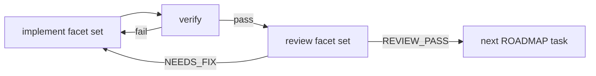

# PR 004: 多ペルソナ QA・Faceted prompting の採用設計

更新: 2026/06/29

## 背景

2026/06 ブックマークレビューで、次の 2 件を**抽象化した上で**本 repo に取り込む。

| # | ソース | 採用パターン |
|---|--------|--------------|
| 3 | [7人の意地悪なQA](https://zenn.dev/nexta_/articles/be13a2395a5d2a) | **7 ペルソナによるテスト観点固定** |
| 4 | [TAKT Faceted Prompting](https://github.com/nrslib/takt) | **persona / policy / knowledge / instruction / output-contract の分離** |

**注**: 当初 `ds-ai-coding-skills` を項目 4 と誤マッピングしていた。正しくは takt の Faceted prompting。DS テンプレは本 repo には入れない（knowledge-base 参照のみ）。

それ以外（mizchi、goal-setter、takt CLI 全体、サイバネティクス記事、headroom、ds-ai-coding-skills）は **knowledge-base** のみ。

新規グローバル skill **`abstract-source-patterns`** で、今後同様の「抽象化→配置」判断を再利用する。

---

## 項目 3: 7 ペルソナ・テスト観点固定（qa-multi-perspective）

### 採用する核心

1. **観点フェーズとケースフェーズの分離**
2. **7 ペルソナの固定**（P1 初見〜P7 仕様懐疑者）
3. **モード 2 分岐** — new-feature / migration
4. **根拠必須** — 仕様・チケット・コード。推測は `要確認`

### 配置

```
templates/project-skills/qa-multi-perspective/
  SKILL.md
  references/
    mode-new-feature.md
    mode-migration.md
    sources.md
    skill-memory.md
```

**global にしない理由**: ケース表の列定義・スタックはプロジェクト依存。手法は QA タスク向け project-skill が適切。

### 展開手順

1. `templates/project-skills/qa-multi-perspective/` → `<repo>/.codex/skills/qa-multi-perspective/`
2. `{{VERIFY_COMMAND}}` をプロジェクトの観点表検証に差し替え
3. `practice-registry.json` に `draft` 登録
4. `AGENTS.md` に「テスト設計 → qa-multi-perspective」1 行

### 7 ペルソナ（抽象定義）

| ID | ペルソナ | 疑う点 |
|----|----------|--------|
| P1 | 初見ユーザー | 直感操作・誤操作・連打 |
| P2 | 熟練オペレータ | キーボード・IME・高速入力 |
| P3 | 敵対的操作者 | 境界値・権限外・二重送信 |
| P4 | データ整合監査 | 永続化層の整合 |
| P5 | 移行担当 | 旧データ・形式差（migration モード中心） |
| P6 | 回帰番人 | 周辺機能・リロード後 |
| P7 | 仕様懐疑者 | 一次情報と実装の突合 |

---

## 項目 4: Faceted prompting（loop/facets）

### 採用する核心（takt からの抽象化）

TAKT は各ワークフローステップに次を**分離して渡す**:

| Facet | 役割 |
|-------|------|
| persona | 誰として振る舞うか（実装者 / レビュアー） |
| policy | 編集可否・スコープ・禁止事項 |
| knowledge | リポの事実・SoT 参照（手順は書かない） |
| instruction | この反復の具体ステップ |
| output-contract | 完了シグナル・成果物形式 |

**1 本の PROMPT に全部書かない**。反復ごとに facet セットを切り替える。

### 配置

```
templates/loop-orchestration/facets/
  README.md
  persona-*.md.template
  policy-*.md.template
  knowledge-repo.md.template
  instruction-*.md.template
  output-contract-*.md.template
  PROMPT-faceted.md.template
  references/sources.md
```

**global にしない理由**: Ralph キットのプロンプト設計の一部。takt CLI は同梱しない。

### 除去した固有要素

- `npm install -g takt` / YAML workflow スキーマ
- `.takt/workflows/` / worktree キュー
- プロバイダプロファイル（claude-sdk, codex, cursor 等）

### 展開手順

1. `loop-orchestration/` を `loop/` にコピー（既存手順）
2. `facets/` を `loop/facets/` にコピー
3. `*.template` → `.md` にリネームし `{{VERIFY_COMMAND}}` 等を置換
4. **implement 反復**: `PROMPT-faceted.md` で implementer セットを指定
5. **review 反復**（任意）: 同じ外側ループで reviewer セットに差し替え
6. `REVIEW_PASS` / `NEEDS_FIX` または verify で次反復を決める

### implement / review の最小 2 フェーズ



### 既存キットとの関係

| 既存 | 関係 |
|------|------|
| `PROMPT.md.template` | 単一ファイル版。facet 未使用のシンプル経路として残す |
| `PROMPT-faceted.md.template` | facet 組み立て版。review 分離が必要なとき |
| `ralph-loop` skill | 概念説明。facet 節へのリンクを追加 |
| `anti-human-bottleneck` | implement 内の人間待ち回避。review は別反復で分離 |

### qa-multi-perspective との関係（正しい対応）

| 項目 | 層 | 用途 |
|------|-----|------|
| 3 — 7 ペルソナ | project-skill | **何を疑うか**（テスト観点） |
| 4 — Faceted prompting | loop facets | **誰が・何を知り・何をして・どう終わるか**（反復プロンプト） |

併用例: review 反復の `persona-reviewer.md` の代わりに、別セッションで `qa-multi-perspective` を起動して観点表を出し、その結果を `loop/review-notes.md` に貼る。

---

## abstract-source-patterns skill

外部ソース → パターンカード → 配置判定。本 PR の誤マッピング（ds-ai-coding → 項目 4）は、**ソースの「アイデア」と「ブックマーク番号」を混同しない**教訓として skill-memory に残す。

## knowledge-base（本 repo 非採用）

| ソース | ノート |
|--------|--------|
| ds-ai-coding-skills | `docs/ai/automations/ds-ai-coding-skills-template.md` |
| mizchi / goal-setter / takt CLI 比較 / サイバネティクス / headroom | 既存ドラフト（`temp/knowledge-base-pr/`） |

## 検証

```bash
bash scripts/install.sh
python3 scripts/verify_repo_setup.py --repo-only
python3 scripts/verify_loop_kit.py
```
