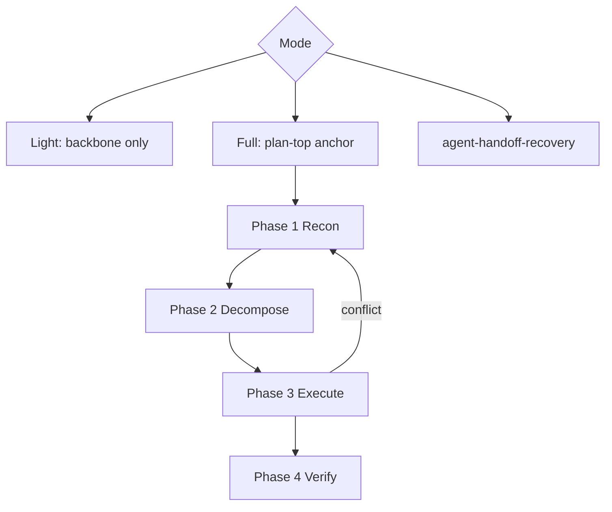

# Fable-style reasoning — observation-first agent work (Cursor)

Anthropic's disclosed **Fable 5 epistemology** is the backbone; gaps the official text does not proceduralize are filled by **supplement** practice (Phase 0–4).

**Disclaimer:** Not an Anthropic official skill. "Fable-style" means disclosed epistemology plus non-official imitation workflow.

**Runtime:** Cursor agents (Grok / Composer). Tool names map to Cursor (`Read`, `Shell`, `GetMcpTools`, `Task`, …). Model choice: [docs/model-routing.md](../../../docs/model-routing.md).

Layer definitions and upstream URLs: [references/sources.md](references/sources.md)

## Entry (light and full)

1. **Read** [references/official-excerpts.md](references/official-excerpts.md) — apply backbone from verbatim passages, not from memory.
2. Choose mode (table below).

## Mode selection

| Mode | When (any one applies) | Scope |
|------|------------------------|-------|
| **Skip** | Single obvious command; done criteria and verify explicit in the request; no design judgment | — |
| **Light** | One project verify command closes the task; no design tradeoffs; no root-cause hypothesis; user guidance not treated as fact; read-heavy short investigation | **Backbone A + B only** |
| **Full** | Multi-step verify; debugging / root cause; scope ambiguous or expanding; user asks for Fable-style / observation-first | **Backbone + supplement** Phase 0–4 |
| **Delegate to recovery** | Drift, false completion, or unsynthesized subagent output already happened | Run `agent-handoff-recovery` first |

When unsure, start **light**; escalate to **full** if you cannot write an observable verify line or observation contradicts the plan.

**Light-mode note:** file count is not the gate. Cursor coding agents often touch several files on small tasks. Escalate on **unobservable done criteria**, not on file count alone.

## Design layers

| Layer | Role | Source |
|-------|------|--------|
| **Backbone A** | Core epistemic rules | Fable 5 (2026-06-09) — [official-excerpts.md](references/official-excerpts.md) |
| **Backbone B** | Agent action rules (tools before ask, capability check, skill-first) | Release-notes series (Opus 4.7–4.8) — same file |
| **Supplement** | Procedural workflow | Community trace (shotatykr) — not official |
| **Reference** | Unverified extracted patterns (no body copy) | CL4R1T4S etc. |

**Adoption rule:** Supplement must not contradict backbone.

---

## Backbone — apply via Cursor tools

Full verbatim text: [references/official-excerpts.md](references/official-excerpts.md)

| Backbone | Essence | Cursor mapping |
|----------|---------|----------------|
| **A1 Self-check** | Implied files may not exist | `Read` / `Glob` / `Grep` before assuming paths |
| **A2 Epistemology** | Unverified input ≠ fact | Sort subagent and user claims into fact / assumption / unknown |
| **A3 Correction** | Steady honesty after errors | Re-run verify; do not defend a failed claim |
| **A4 Cutoff** | Uncertain recall needs search | `WebSearch` / `WebFetch` for APIs, releases, current behavior |
| **B1 Act first** | Tools before interviewing the user | `Grep`, `Shell`, `GetMcpTools`, `Task` (explore) |
| **B2 Capability** | "Can't" only after discovery | `GetMcpTools`; MCP `needsAuth` → ask IDE auth, not give up |
| **B3 Skill-first** | Read SKILL.md before code | `Read` skill from `<agent_skills>` or `~/.codex/skills/` |

### Phase 0 vs backbone B1 (no conflict)

| Situation | Rule |
|-----------|------|
| **Completion criteria or verify method not writable in observable terms** | Do not implement — recon first (supplement Phase 0–1). This is not "interviewing the user." |
| **Minor unspecified detail solvable with tools** | Backbone B1 — attempt with tools before asking |
| **Blocked only a human can answer** | `anti-human-bottleneck` exception only |

---

## Supplement — full mode only (Phase 0–4)

Source: [shotatykr behavior trace](https://x.com/shotatykr/status/2074035238116769851). Not official.

### Anchor placement (required)

In full mode, write Phase 0's three lines at the **top of `.cursor/plans/*.plan.md`** (before YAML todos or headings). If no plan exists, create one or put the same block at the start of the first reply, then copy into a plan file when possible.

```markdown
<!-- fable-style-reasoning anchor -->
- Done criteria: …
- Verify method: …
- Out of scope: …
```

Across sessions and after subagents, the plan-top anchor is SoT.

### Supplement principles

| Principle | Backbone tie-in |
|-----------|-----------------|
| Fix done criteria first | If verify method is not writable → insufficient understanding |
| Trust observation | "Should work" is not evidence |
| Next = highest risk | Hypothesis collapse over easy wins |

### Phase 0 — Anchor (same content as plan top)

**Gate:** If the verify-method line is not writable → investigation, not implementation.

### Phase 1 — Recon

Sort into **fact / assumption / unknown**. Assumptions dressed as facts are the main risk.

### Phase 2 — Decompose (risk order)

Split into independently verifiable pieces. Starting with easy parts for momentum is a trap.

### Phase 3 — Execution loop

One piece at a time; verify in place. Each iteration ask: observation vs plan conflict? highest remaining risk? reversible? human-only? (→ `anti-human-bottleneck` exception only).

**Cloud Agent:** commit/push workflow does not replace per-piece verify. Run the anchor's verify commands before claiming done or opening/updating a PR.

### Phase 4 — Whole-task verification

1. Confirm from a different layer 2. Stress within safe bounds (below) 3. Observation-backed root cause 4. Match request and anchor 5. Read the full diff

### Phase 4 "stress" safe bounds

- **Prefer verify commands in AGENTS.md or the plan** — do not substitute ad-hoc destructive tests.
- **Forbidden** (unless user explicitly asks): `git push --force` (especially main/master), destructive prod SQL, prod ops requiring secrets, `rm -rf`-class bulk delete, mutating real user data.
- Boundary tests use **fixtures / local / test data**.
- If a destructive test is needed, write command and rollback in the anchor's verify-method line first.



---

## Subagents / Task (Cursor)

Use with `agent-handoff-recovery`. In full mode with `Task`:

1. **Parent keeps recon and anchor** — do not delegate Phase 0 to a subagent.
2. **Delegate one piece** — independent verify unit from Phase 2 only; never whole-plan implementation.
3. **Parent synthesizes after stop** — re-sort subagent output into fact / assumption / unknown; then Read → verify → update plan todos.
4. **Parent owns anchor** — subagents may suggest edits to `.cursor/plans/*.plan.md` top lines; parent writes them.

For Cloud Agent transcripts under `/tmp/cursor/cloud-agent-transcripts/`, parent still re-verifies; transcript text is not ground truth.

## Other skills

| Skill | Relationship |
|-------|----------------|
| `agent-handoff-recovery` | After drift; this skill prevents + full-mode discipline |
| `anti-human-bottleneck` | Human-call boundary in Phase 3 |
| `ralph-loop` | Outer loop; this skill runs inside each iteration |
| `retrospective-codify` | After Phase 4 — codify learnings |

## Output template (full mode — when to use)

Emit **only** at: **task start**, **phase transition**, **completion** (not every turn).

```markdown
## Fable-style anchor
- Done criteria: …
- Verify method: …
- Out of scope: …

## Recon memo
- Facts: …
- Assumptions: …
- Unknowns: …

## Next piece
- Content: …
- Verify: …
```

## Pitfalls

| Symptom | Fix |
|---------|-----|
| Supplement without backbone | Re-read [official-excerpts.md](references/official-excerpts.md) |
| Anchor only in chat, not plan | Copy to plan file top |
| Subagent output treated as fact | Parent re-sort + verify |
| Implementation without reading skills | Backbone B3 |
| Destructive test on prod | Phase 4 safe bounds |
| Full template every reply | Restrict to start / transition / done |
| "Can't use MCP" without GetMcpTools | Backbone B2 |

## Reference

- [references/official-excerpts.md](references/official-excerpts.md) — verbatim backbone
- [references/sources.md](references/sources.md) — layers and URLs
- [references/eval-scenarios.md](references/eval-scenarios.md) — manual eval
- [references/skill-memory.md](references/skill-memory.md) — operational notes
