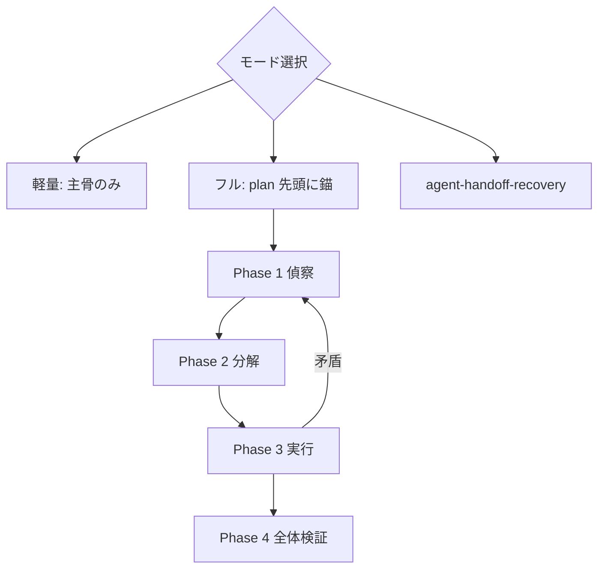

# Fable-style reasoning — 観測優先のエージェント推論

Anthropic が公式開示した Fable 5 の**基本思想**を主骨とし、公式だけでは手順化されていない部分を**補助実践知**で補う skill。

**免責**: Anthropic 公式 skill ではない。「Fable-style」は開示された認識論と、公式未記載分の模倣手順を指す。

層の定義と出典: [references/sources.md](references/sources.md)

## モード選択

| モード | いつ使うか（いずれか該当でよい） | 適用範囲 |
|--------|----------------------------------|----------|
| **使わない** | 1 コマンドで終わる自明操作。完了条件と verify が依頼に明示済みで変更が 1 ファイル以内 | — |
| **軽量** | 変更が 1〜2 ファイルで verify が 1 コマンドに収まる。依頼に観測可能な完了条件あり。読み取り中心の短い調査 | **主骨のみ**（認識論・自己確認・誠実な訂正） |
| **フル** | 複数ファイル・設計判断・デバッグ／原因究明。verify が 2 段以上または未確定。スコープ曖昧・膨らみかけ。ユーザーが Fable-style / 観測優先を明示 | **主骨 + 補助** Phase 0–4 |
| **回復へ委譲** | ずれ・偽完了・サブエージェント未統合が既に起きている | `agent-handoff-recovery` を先に |

迷ったら **軽量** から始め、検証行が書けない・観測が矛盾したら **フル** に昇格する。

## 設計の層

| 層 | 役割 | 出典 |
|----|------|------|
| **主骨** | skill 設計の基本思想 | Anthropic 公式開示 |
| **補助** | 主骨を手順に落とす実践知 | コミュニティ挙動トレース（shotatykr 等） |
| **参考** | 非公式抽出のパターン（本文コピーなし） | CL4R1T4S 等 |

**採用規則**: 主骨と矛盾する補助は採用しない。

---

## 主骨 — Anthropic 公式開示の基本思想

出典: [System Prompts — Claude Fable 5 (2026-06-09)](https://platform.claude.com/docs/en/release-notes/system-prompts)

### 1. 認識論 — 検証できないことは断定しない

- 検証不能な主張を避ける（good epistemology）。
- 「動くはず」「おそらく原因は X」は仮説。完了の根拠にしない。

### 2. 自己確認 — 示唆されても自分で確かめる

- ファイル・画像の存在**示唆**でも、自分で確認してから進む。
- 変わりうる現状は記憶よりツール結果・検索を優先。

### 3. 誠実な訂正 — 誤りは認め、観測に戻る

### 4. 能力の先読み（公式系列・エージェント向け）

- コード・ファイル作業前に該当 **skill を先に Read**。
- ツール使用前に利用可否を確認。
- タスクの複雑さに応じて確認の深さを変える。

---

## 補助 — フルモードのみ（Phase 0–4）

出典: [shotatykr — 挙動トレース](https://x.com/shotatykr/status/2074035238116769851)。公式未記載の模倣手順。

### 錨の置き場（必須）

フルモードでは Phase 0 の 3 行を **`.cursor/plans/*.plan.md` の先頭**（YAML todo や見出しより前）に書く。plan が無い場合は作成するか、着手返信の先頭に同内容を置き、可能なら直後に plan ファイルへ転記する。

```markdown
<!-- fable-style-reasoning anchor -->
- 完了条件: …
- 検証方法: …
- やらないこと: …
```

セッション跨ぎ・サブエージェント後は plan 先頭の錨を SoT とする。

### 補助の三原則

| 原則 | 主骨との対応 |
|------|----------------|
| 完了条件を先に固定 | 検証方法が書けない＝理解不足 |
| 観測を信じる | 「動くはず」は証拠にしない |
| 次は最大リスクへ | 計画の行順より仮説潰し |

### Phase 0 — 錨（plan 先頭と同内容）

**ゲート**: 検証方法の行が書けない → 実装に入らず調査へ。

### Phase 1 — 偵察

事実 / 仮定 / 不明に仕分け。事実のふりをした仮定が最大のリスク。

### Phase 2 — 分解（リスク順）

独立検証単位に切る。簡単な所から勢いをつけるのは罠。

### Phase 3 — 実行ループ

1 ピースずつその場で検証。各イテレーションで自問: 観測と計画の矛盾 / 最大リスク / 可逆性 / 人間のみ回答可能か（→ `anti-human-bottleneck` 例外のみ）。

### Phase 4 — 全体検証

1. 別の層で確認 2. 壊しに行く（下記安全境界内） 3. 原因の観測裏取り 4. 依頼・錨と突合 5. diff 通読

### Phase 4「壊しに行く」の安全境界

- **AGENTS.md や plan に書かれた verify コマンドを優先**する。独自の破壊的試験で代替しない。
- **禁止**（ユーザー明示がない限り）: `git push --force`（特に main/master）、本番 DB への破壊的 SQL、資格情報を要する本番操作、`rm -rf` 相当の一括削除、実ユーザーデータの改変。
- 境界値試験は **fixture / ローカル / テスト用データ** で行う。
- 破壊的試験が必要なら、錨の「検証方法」行にコマンドとロールバック手順を先に書く。



---

## サブエージェント / Task 併用時

`agent-handoff-recovery` と併用する。フルモードで Task を使うとき:

1. **偵察と錨は親が保持** — サブエージェントに Phase 0 全体を委ねない。
2. **委譲は 1 ピース単位** — Phase 2 で切った独立検証単位まで。計画全体の実装委譲は禁止。
3. **停止後は親が統合** — サブエージェントの出力を事実 / 仮定 / 不明に再仕分けしてから次へ。変更を Read → verify → plan todo 更新。
4. **錨の更新は親** — `.cursor/plans/*.plan.md` 先頭の 3 行は親が書き、サブエージェントは追記提案のみ。

## 他 skill との役割分担

| skill | 関係 |
|-------|------|
| `agent-handoff-recovery` | ずれ発生後。本 skill は予防＋フルモード規律 |
| `anti-human-bottleneck` | Phase 3 の人間呼び出し境界 |
| `ralph-loop` | 外側ループ。各イテレの内側に本 skill |
| `retrospective-codify` | Phase 4 後の知見固定化 |

## 出力テンプレート（フルモード）

plan 先頭と同内容を返信にも含める。

```markdown
## Fable-style 錨
- 完了条件: …
- 検証方法: …
- やらないこと: …

## 偵察メモ
- 事実: …
- 仮定: …
- 不明: …

## 次の 1 ピース
- 内容: …
- 検証: …
```

## 落とし穴

| 症状 | 対処 |
|------|------|
| 補助だけ真似して主骨を無視 | 主骨に戻る |
| 錨がチャットのみで plan に無い | plan 先頭へ転記 |
| サブエージェント結果を事実扱い | 親が再仕分け・verify |
| skill を読まずに実装 | 主骨 4 |
| 破壊的試験で本番を触った | Phase 4 安全境界に戻る |

## Reference

- [references/sources.md](references/sources.md) — 主骨 / 補助 / 参考
- [references/eval-scenarios.md](references/eval-scenarios.md) — 手動 eval シナリオ
- [references/skill-memory.md](references/skill-memory.md) — 運用メモ
