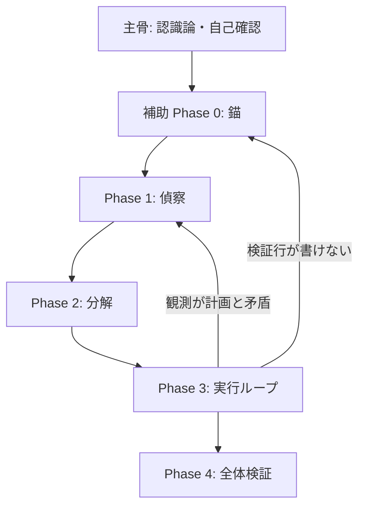

# Fable — 観測優先のエージェント推論

Anthropic が公式開示した Fable 5 の**基本思想**を主骨とし、公式だけでは手順化されていない部分を**補助実践知**で補う skill。任意のエージェント（Cursor / Codex / Claude Code 等）向けに抽象化している。

層の定義と出典: [references/sources.md](references/sources.md)

## 設計の層

| 層 | 役割 | 出典 |
|----|------|------|
| **主骨** | skill 設計の基本思想。何を信じ、何を断定しないか | Anthropic 公式開示 |
| **補助** | 主骨をエージェント手順に落とす実践知。公式にないときだけ採用 | コミュニティの挙動トレース（shotatykr 等） |
| **参考** | 非公式抽出から取れるパターン。本文コピーはしない | CL4R1T4S 等（未検証） |

**採用規則**: 主骨と矛盾する補助は採用しない。主骨だけで足りる場面では補助レイヤを省略してよい。

## いつ使うか

- 実装・調査・デバッグなど、**完了条件が一文で言えない**タスク
- 「動くはず」「たぶん直った」が出そうなとき
- エージェントに Fable 型の慎重さ・段階検証をさせたいとき

使わない場面:

- 1 コマンドで終わる自明な操作
- ずれが既に深刻 → 先に `agent-handoff-recovery`
- 外側の無人収束ループ → `ralph-loop` が主、本 skill は各イテレーションの内側

---

## 主骨 — Anthropic 公式開示の基本思想

出典: [System Prompts — Claude Fable 5 (2026-06-09)](https://platform.claude.com/docs/en/release-notes/system-prompts)（消費者向け chat の一部。API には非適用）

### 1. 認識論 — 検証できないことは断定しない

- 状況理解はユーザー入力に依存し、**自分では検証できない** — 検証不能な主張を避ける（good epistemology）。
- 「動くはず」「おそらく原因は X」は**仮説**であり、完了の根拠にならない。
- 不確実なら不確実と述べ、ツールで確認してから結論を更新する。

### 2. 自己確認 — 示唆されても自分で確かめる

- プロンプトがファイル・画像の存在を**示唆**しても、存在するとは限らない。**自分で確認**してから進む。
- カットオフ以降や変わりうる現状は、記憶より**ツール結果・検索**を優先する。

### 3. 誠実な訂正 — 誤りは認め、観測に戻る

- 誤りは認め、問題の解決に集中する（過度な謝罪や放棄ではなく、観測ベースで修正）。

### 4. 能力の先読み（公式周辺・エージェント向け拡張）

同一ドキュメント系列の Fable / Opus 消費者プロンプトに沿う運用:

- コード・ファイル生成前に、該当 **skill を先に Read** する（環境制約は訓練データにない）。
- ツール使用前に**利用可否を確認**する。
- タスクの複雑さに応じて確認の深さを変える（単純なら浅く、複雑なら多層で）。

これらは**思想の延長**であり、Phase 0–4 のような手順番号は公式にはない。

---

## 補助 — 公式でカバーしきれない実践手順

出典: [豊藏 翔太 @shotatykr](https://x.com/shotatykr/status/2074035238116769851) — Fable 5.0 の出力をトレースし手順化。**挙動の模倣ロジック**として採用。公式未記載のため、上記主骨と矛盾しない範囲に限定する。

### 補助の三原則（主骨の操作化）

| 原則 | 主骨との対応 |
|------|----------------|
| 完了条件を先に固定する | 検証方法が書けない＝まだ理解不足（主骨 1・2 の実装ゲート） |
| 観測を信じる | 「動くはず」は証拠にしない（主骨 1 の具体化） |
| 次は最大リスクへ | 公式に手順番号はない。計画の行順より仮説潰しを優先 |

### Phase 0 — 触る前に 3 行（錨）

```markdown
- 完了条件: （観測可能な形。例: `pytest tests/foo.py` が exit 0）
- 検証方法: （具体的コマンド・diff・実行結果・目視手順）
- やらないこと: （今回のスコープ外。1〜3 項目）
```

**ゲート**: 検証方法の行が書けない → 実装に入らず調査へ（主骨 2）。

### Phase 1 — 偵察

計画の前に実物を軽く読み、**事実 / 仮定 / 不明**に仕分ける。一番危険なのは事実のふりをした仮定（主骨 1・2 の作業台帳）。

### Phase 2 — 分解（リスク順）

独立して検証できる単位に切る。外れたら計画が崩れる仮定を先に。簡単な所から勢いをつけるのは罠。

### Phase 3 — 実行ループ

1 ピースずつ、その場で検証。各イテレーションで自問:

- 観測は計画と矛盾していないか
- いま最大のリスクはどこか
- 次の行動は可逆か
- 人間にしか答えられないことで詰まっているか → `anti-human-bottleneck` の例外のみ

### Phase 4 — 全体検証

1. 別の層で確認（コード→実行、文章→初見読み）
2. 壊しに行く（境界値を実際に当てる）
3. 原因説明を観測で裏取り（証拠なき原因は「寄与は未確認」）
4. 依頼原文・Phase 0 の錨と突合
5. diff 通読



---

## 他 skill との役割分担

| skill | 関係 |
|-------|------|
| `agent-handoff-recovery` | ずれ発生後の整理。本 skill は主骨＋予防 |
| `anti-human-bottleneck` | Phase 3 の人間呼び出し境界 |
| `ralph-loop` | 外側ループ。内側に本 skill |
| `retrospective-codify` | Phase 4 後の知見固定化 |

## 出力テンプレート

```markdown
## Fable 錨
- 完了条件: …
- 検証方法: …
- やらないこと: …

## 偵察メモ
- 事実: …
- 仮定: …
- 不明: …

## 次の 1 ピース
- 内容: …
- 検証: …
```

## 落とし穴

| 症状 | 対処 |
|------|------|
| 補助手順だけ真似して主骨を無視 | 主骨（観測・自己確認）に戻る |
| 長い計画だけでファイルを開かない | Phase 1 |
| テストを最後にまとめて実行 | Phase 3 |
| skill を読まずに実装 | 主骨 4（skills-first） |
| 完了報告に根拠がない | Phase 4 |

## Reference

- [references/sources.md](references/sources.md) — 主骨 / 補助 / 参考の出典と採用境界
