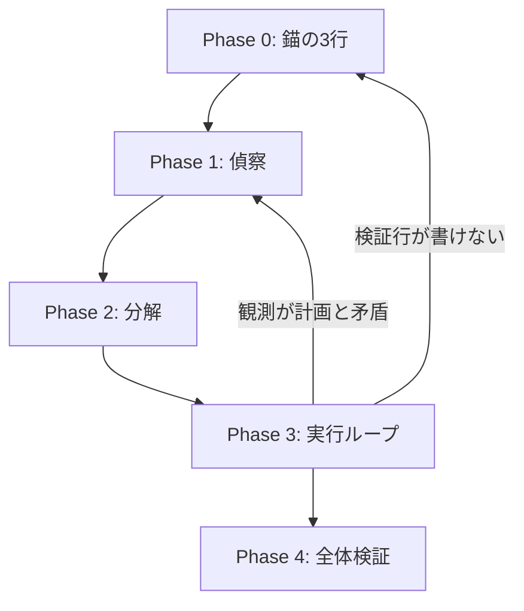

# Fable — 観測優先のエージェント推論

Fable 5（Anthropic）の消費者向け挙動から抽出した**観測優先・リスク順・段階検証**のワークフロー。モデル固有のプロンプトをコピーするのではなく、任意のエージェント（Cursor / Codex / Claude Code 等）で再現できる手順に抽象化した。

出典と公式/非公式の区別: [references/sources.md](references/sources.md)

## いつ使うか

- 実装・調査・デバッグなど、**完了条件が一文で言えない**タスク
- 「動くはず」「たぶん直った」が出そうなとき
- 計画は立ったが、**検証方法の行が書けない**とき
- スコープが膨らみかけているとき
- エージェント出力の品質を上げたいが、モデル差に依存したくないとき

使わない場面:

- 1 コマンドで終わる自明な操作（skill 起動のオーバーヘッドが大きい）
- すでに `agent-handoff-recovery` が必要な深刻なずれ → 先にそちらで状況整理
- 外側の無人収束ループ → `ralph-loop` が主、本 skill は各イテレーションの内側

## 三原則（常に先に適用）

1. **完了条件を先に固定する** — 検証方法（コマンド・diff・実行結果）が書けないタスクは、まだ理解できていない。
2. **自分の主張ではなく観測を信じる** — 「動くはず」は証拠ではない。実物を見るまで完了と言わない。
3. **次の一手はいま一番リスクが高い場所** — 元の計画の次の行ではなく、計画が崩れる仮定を先に潰す。

## ワークフロー



### Phase 0 — 触る前に 3 行（錨）

何かに触る前に、次の 3 行だけ書く。途中でスコープが膨らみかけたら毎回ここと照合する。

```markdown
- 完了条件: （観測可能な形で。例: `pytest tests/foo.py` が exit 0）
- 検証方法: （具体的コマンド・diff・実行結果・目視手順）
- やらないこと: （今回のスコープ外。1〜3 項目）
```

**ゲート**: 検証方法の行が書けない → 実装に入らず、先に調査（Read / Grep / 実行）へ。

### Phase 1 — 偵察（計画の前に実物を読む）

計画を立てる前に、関連ファイル・コマンド出力・既存テストを**軽く**読む。読んだ内容を仕分ける。

| 区分 | 定義 | 例 |
|------|------|-----|
| **事実** | ツールで確認済み | `git status` の出力、Read した関数のシグネチャ |
| **仮定** | まだ未確認だが作業に使っている | 「先週の変更が原因」「この API は同期」 |
| **不明** | 調べないと分からない | 本番のみの設定、未読の依存モジュール |

**核心**: 一番危険なのは**事実のふりをした仮定**。ユーザーや過去セッションの誘導（「おそらく X が怪しい」）は仮定として扱い、偵察で裏取りする。

公式開示に沿う習慣（Fable 消費者プロンプト）:

- ファイルがある前提の指示でも、**自分で存在を確認**してから進む
- 現状が変わりうる事実は、記憶よりツール結果を優先する

### Phase 2 — 分解（独立検証単位・リスク順）

概念ではなく、**独立して検証できる単位**で切る。順序はリスク順。

1. 外れたら計画全体が崩れる仮定
2. 手戻りコストが大きい変更
3. その他

**罠**: 簡単なところから片付けて勢いをつける。核心が不成立なら、周辺の完成品は全部捨てることになる。

各ピースに Phase 0 のミニ版（完了条件 + 検証方法）を 1 行ずつ付ける。

### Phase 3 — 実行ループ（その場で検証）

1 ピースずつ進め、**その場で**検証する。最後にまとめて検証しない（失敗の発見が遅れるほど原因候補が増える）。

各イテレーションの終わりに 4 つの自問:

| 自問 | 意図 |
|------|------|
| 観測は計画と矛盾していないか | 偽の進捗を止める |
| いま最大のリスクはどこか | 次の一手をリスク順に |
| 次の行動は可逆か | 不可逆なら先に調査・バックアップ |
| 人間にしか答えられないことで詰まっているか | 詰まっているなら `anti-human-bottleneck` の例外規則に従い最小質問 |

**行動 vs 調査**: 手戻りコストと確認コストを比較する。安く確認できるなら先に Read / 小さな再現実験。

### Phase 4 — 全体検証（証拠付き完了）

「直した」と言う前に、次の 5 点を満たす。

1. **別の層で確認** — コードなら実行・テスト。文章なら初見の読者として読む。設定なら実際の適用パス。
2. **壊しに行く** — 空入力・境界値・異常系を実際に当てる（想像で済ませない）。
3. **原因説明を観測で裏取り** — 報告の各原因に「症状へ寄与した証拠」を 1 つずつ。なければ「寄与は未確認」と書く。コードが直っていても説明が観測と矛盾していれば報告は無効。
4. **依頼原文との突き合わせ** — Phase 0 の完了条件・やらないことと一致するか。
5. **diff 通読** — 意図しない変更・デバッグ残骸・スコープ外の混入がないか。

## 他 skill との役割分担

| skill | 関係 |
|-------|------|
| `agent-handoff-recovery` | ずれが既に起きた後の状況整理。本 skill は予防と実行中の規律 |
| `anti-human-bottleneck` | Phase 3 で人間を呼ぶのは物理的に不可能なときのみ |
| `ralph-loop` | 外側ループ。各イテレーションの内側に本 skill を適用 |
| `retrospective-codify` | Phase 4 後、繰り返しの落とし穴をルール化 |
| `skill-lifecycle` | 手順が定着したら repo-local skill へ昇格を検討 |

## 出力テンプレート（ユーザー向け）

非自明タスクでは、着手時に次を短く提示してよい。

```markdown
## Fable 錨
- 完了条件: …
- 検証方法: …
- やらないこと: …

## 偵察メモ
- 事実: …
- 仮定: …
- 不明: …

## 次の 1 ピース
- 内容: …
- 検証: …
```

完了時は観測ベースで報告する（「〜のはず」ではなく、実行したコマンドと結果）。

## 落とし穴

| 症状 | 対処 |
|------|------|
| 長い計画だけでファイルを開かない | Phase 1 に戻る |
| テストを最後にまとめて実行 | Phase 3 のその場検証に戻る |
| ユーザー誘導を事実として採用 | 仮定列に移し偵察 |
| skill を読まずに実装開始 | 該当 skill があれば先に Read（Fable 公式の skills-first 方針） |
| 完了報告に根拠がない | Phase 4 の原因裏取りを満たすまで未完 |

## Reference

- [references/sources.md](references/sources.md) — 着想・公式開示・非公式抽出の区別
