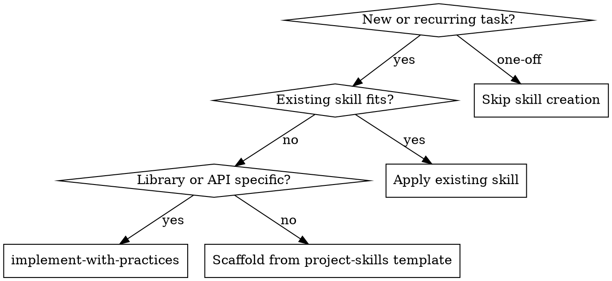

# Skill Lifecycle — Reference

## Decision flow

## Skill boundaries

| Skill | Scope | Trigger |
|-------|--------|---------|
| `skill-lifecycle` | Task-category skills, registry, reuse | Recurring workflow, skill-ify request |
| `implement-with-practices` | Tech stack patterns in this repo | Library/API/framework implementation |
| `retrospective-codify` | Post-task learnings → rule/skill/lint | Task done, "ルール化して" |
| `empirical-prompt-tuning` | Prompt/skill quality via blind executor | New or revised skill needs hardening |

## Search locations

| Location | Contents |
|----------|----------|
| `~/.codex/skills/` | Global skills (install.ps1 from bokujuu_cursorsetup) |
| `.codex/skills/` | Repo-local draft/approved skills |
| `.cursor/skills/` | Cursor project-local skills |
| `.codex/practice-registry.json` | Index of repo-local practices |

## MUSE mapping (summary)

Full table: [docs/references/muse-autoskill.md](../../docs/references/muse-autoskill.md).

| MUSE stage | This repo |
|------------|-----------|
| Creation | Template scaffold or `scaffold_local_skill.py` |
| Memory | `references/skill-memory.md` per skill |
| Management | `practice-registry.json` |
| Evaluation | Verification commands in skill + registry |
| Refinement | skill-memory updates, `retrospective-codify` |

## Related

- [implement-with-practices references/overview.md](../implement-with-practices/references/overview.md)
