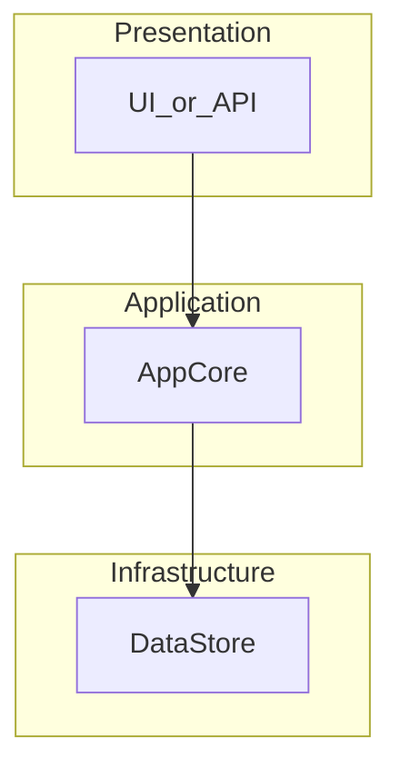
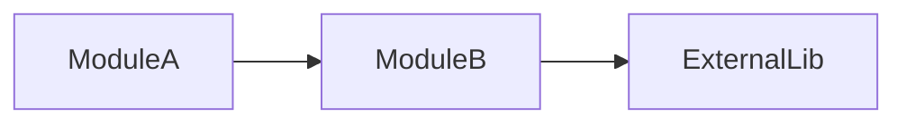

# Architecture overview

> Generated/maintained per `system-structure-viz` skill. Update when top-level layout or major dependencies change.

## Module layers

## Key dependencies

## Notes

- **Scope**: …
- **Last updated**: YYYY/MM/DD
- **Verify**: …（how to validate this diagram still matches code）
